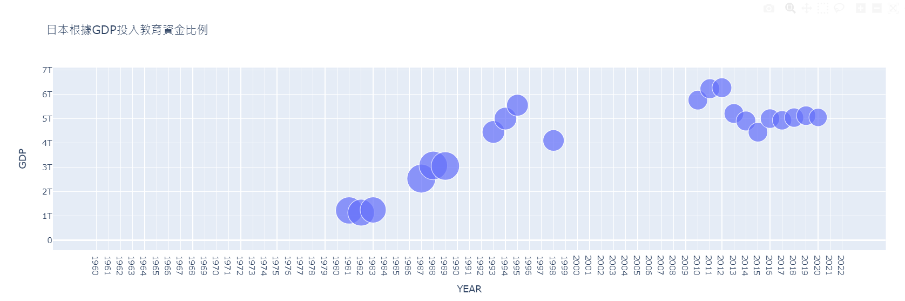
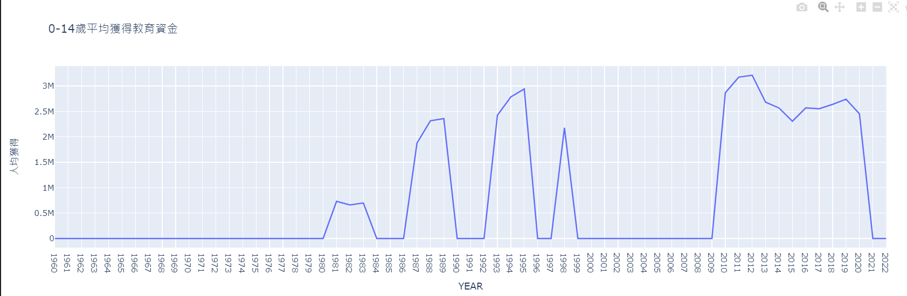
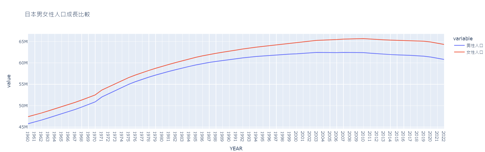

# 112-1 師大科技系程式語言

授課教師：蔡芸琤老師

姓名：游建佑

系級：科技系二年級

## 課程筆記區

1012 資料正則化 Regular Expression : 

[測試網站](https://regexr.com/)  [語法英文](http://perso.ens-lyon.fr/lise.vaudor/strings-et-expressions-regulieres/?fbclid=IwAR0IHvNKp43Qrfo0TqpolYPpMUfViSrCBDY8SmBveKm01yZ6PzHPxspVaNI)  [語法中文](http://www.vixual.net/blog/archives/211)

import re 匯入Regular Expression套件

text = """要匯入的文本"""  三個引號可以搞定換行問題

pattern = r'檢索條件'  pattern = re.compile(r'Your Pattern Here', re.DOTALL) re.DOTALL可用於將print出來的東西換行

.*?  用於段落編號後的接續文本  (?=\d+\.|\Z): 使用正向预查来匹配下一个段落编号或文本结束（即，段落结束）建佑表示????工三小

## 作業區
[HW1](https://colab.research.google.com/drive/1yXtT4luoalVF8kJ3dLoWcpSMCYhfRzgg?hl=zh-tw)

[HW2](105task2.ipynb)

[HW2.1](二下午通識/hw11)
## 專題連結區
